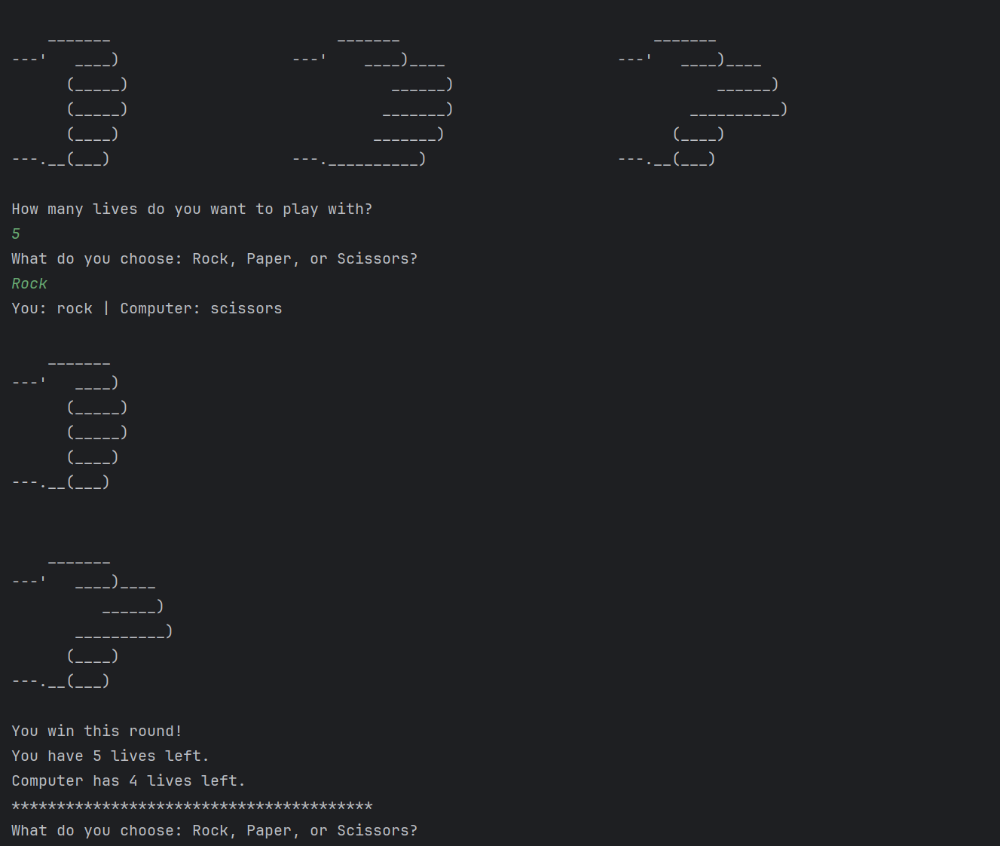

# 🎮 Rock Paper Scissors ✊ 📄 ✂️

A simple **Rock, Paper, Scissors** game in Python.  
Features **ASCII art**, a **lives system**, and a **replay option**.

---

## ✨ Features
- 🎨 ASCII art for Rock, Paper, and Scissors
- ❤️ Lives system (choose how many lives at start)
- 🔄 Replay option after each game
- ✅ Input validation (prevents invalid choices)

---

## ▶️ How to run

Clone the repository:
```bash
git clone https://github.com/SajQ-cmd/Rock-Paper-Scissors.git
cd Rock-Paper-Scissors
python rock_paper_scissors.py


What do you choose: Rock, Paper, or Scissors?
You: rock | Computer: scissors

    _______
---'   ____)
      (_____)
      (_____)
      (____)
---.__(___)

    _______
---'   ____)____
          ______)
       __________)
      (____)
---.__(___)

🎉 You win this round!
You have 2 lives left.
Computer has 1 life left.

## 🖼️ Screenshot

